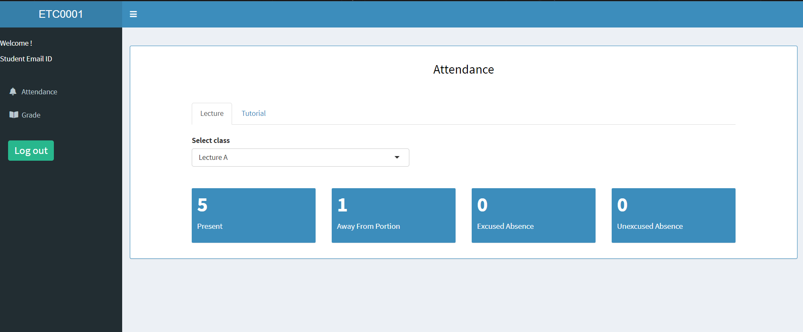
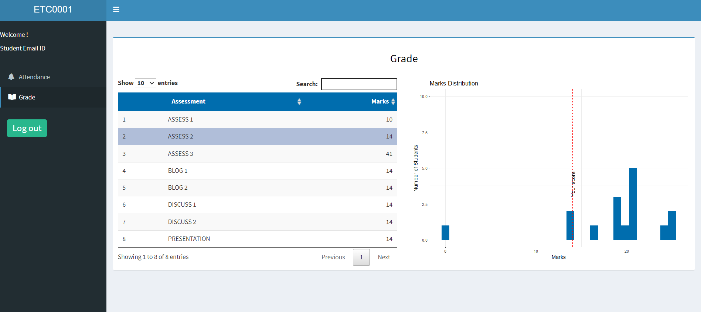
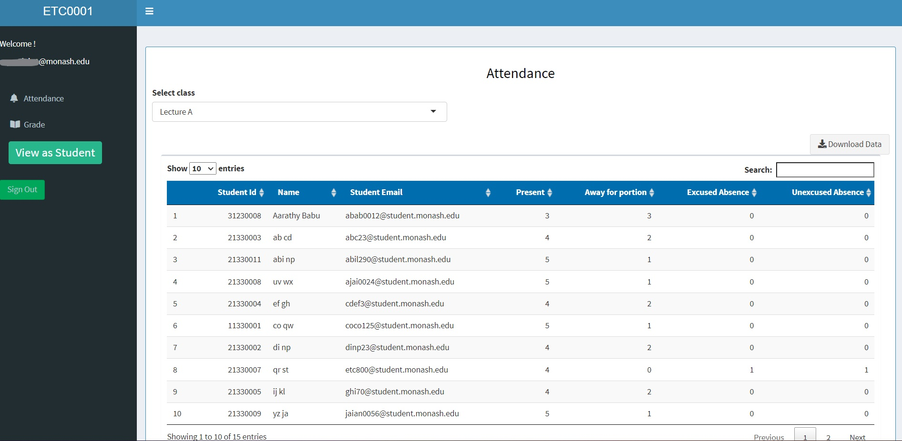
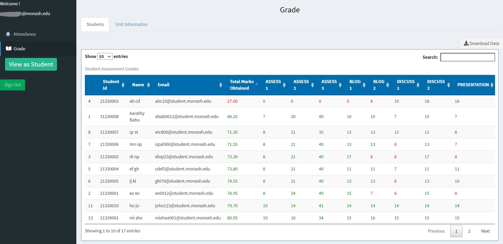
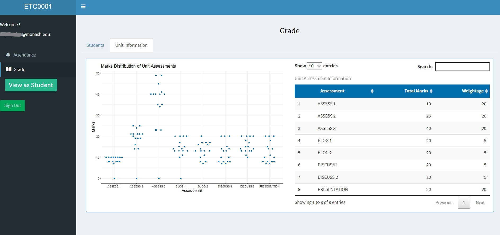
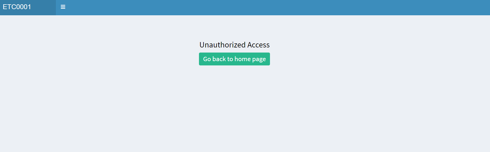

<!-- README.md is generated from README.Rmd. Please edit that file -->

# sugar

<!-- badges: start -->
<!-- badges: end -->

Shiny Unit Grade and Attendance Reviewer, or SUGAR, is a shiny web app
that allows students to see their grade and attendance of a unit.

## Installation

Install the package from [GitHub](https://github.com/) with:

``` r
# install.packages("devtools")
devtools::install_github("numbats/sugar")
```

The R shiny application is accessible to both students and teaching
staff to view the attendance and assessment grades of the students
enrolled in a unit.

## Student View

The student view consists of two tabs, Attendance and Grade.

-   Attendance



-   Grade

The tab shows the marks scored by the student in each assessment and the
corresponding performance of the class for that assessment, however the
class performance is only shown to the students if the class strength is
above 15 students.



## Staff View

-   Attendance

The attendance tab contains the attendance of the students enrolled in
the unit which can be downloaded as a .CSV file.



-   Grade

The grade tab shows the grades of each student color coded according to
the pass marks. Like attendance, grades of students can also be
downloaded as a .CSV file.

 The pass marks is calculated
according the unit assessment information.



-   View as Student

The feature allows teaching staff to view the app from the student’s
perspective.

## Authorized Access

Only students enrolled in the unit and authorized staff can access the
application.


