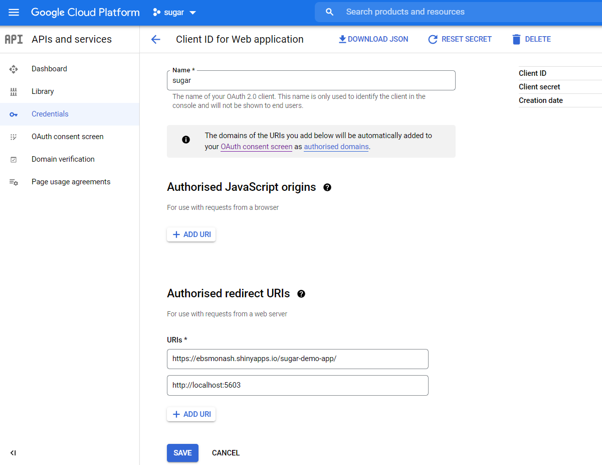

```{r, include = FALSE}
knitr::opts_chunk$set(
  collapse = TRUE,
  comment = "#>"
)
```

The shiny web application uses Google login of the student or teaching staff concerned to access the information. To set up this feature, one must set up Google Cloud Platform Credentials and follow the steps mentioned in the Package workflow. Below given are the steps required to set up the credentials and obtain the Client ID and Client secret for the application. 

# Setup a Google API project

- Log in to Google and visit the [Google APIs project](https://console.developers.google.com/iam-admin/projects) page using your Monash Staff credentials.

- Click the “Create Project” link at the top and enter a name for the project (e.g. “ETC5521”). You will be redirected to the Google API Manager.

- Click on the Google People API link under “Social APIs” and click the “Enable” link at the top to activate the Google People API.

# Setup authentication credentials

- Click the “[Credentials](https://console.cloud.google.com/apis/credentials)” link in the menu on the left.

- Go to the "OAuth consent screen" tab towards the top of the page.

- Replace the product name given to users on the app registration form with the name of your Shiny app. When users click the "Login with Google" link in your app, the information you supply in this tab populates the authentication screen that appears.

- Navigate to the “Credentials” tab at the top.

- From the “Create Credentials” dropdown menu, select “OAuth client ID” and select “Web application” for the application type.

- For this authentication client, you may give it any name you choose. Fill in the URL for your Shiny app in the redirect URLs area such as https://ebsmonash.shinyapps.io/sugar-demo-app/ (Contact Emi Tanaka to get your email added to use the Monash EBS shiny account.) or  http://localhost:5603 (This is to facilitate local development and testing of your app). 

Refer the image below.




- A client ID and secret will appear when you save this information. These should be copied and pasted into your code afterwards. 
